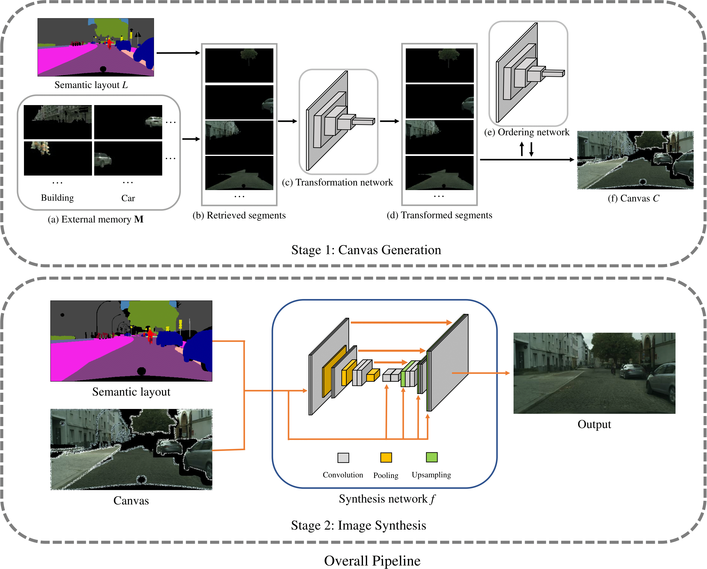

# Semi-parametric Image Synthesis (SIMS)

This is a Tensorflow implementation of Semi-parametric Image Synthesis (SIMS).

## Setup

### Requirement
Required python libraries: Tensorflow (>=1.2) + Scipy + Numpy + Pillow + OpenCV.

Tested in Ubuntu + Intel i7 CPU + Nvidia Titan X (Pascal) with Cuda (>=8.0) and CuDNN (>=5.0). CPU mode should also work with minor changes.

### Quick Start (setup)
1. Clone this repository.
2. Enter the cloned folder.
3. Download VGG19 network from "https://drive.google.com/open?id=0B_B_FOgPxgFLRjdEdE9NNTlzUWc" and  run  "mv ./imagenet-vgg-verydeep-19.mat ./python_code/Models"
4. Download all the results and intermediate result from "https://drive.google.com/open?id=1UFaRl_3EGK0hSBlmB6AJVeZZ_r-SHQLm", and run "unzip result.zip" (The final result is saved in folder "all_results", and the intermediate result data is saved in folder "result")
5. Download the pretrained models (trainedmodels.zip) from "https://drive.google.com/open?id=1MgEHYbMM7DAwoFpaH0Z5IRglFzTT6Fd5". It takes several minutes to download all the models.
6. Download the test data (testdata.zip) from "https://drive.google.com/open?id=1w7Nk3U8lKGlCDch_tn_hu9bpWZYLdhbN". It is approximately 11Gb in size. 
7. Download the training data (traindata.zip) from "https://drive.google.com/open?id=1UoZ2_TnA-IrRLtgvvznUO3VZbOwXwZI-". It is approximately 60Gb in size

### Inference
Use resolution "512 x 1024" as a running example.
[Try on your own semantic maks
(1) cd "matlab_code";
(2) run "test_connect_component_mask.m" (replace label_path) and the generated mask will stored in "../testdata/original_mask" (Disclaimer: you should modifiy the code according based on your own data format);
(3) run "search_segments.m"  and the generated result will be saved in folder "searched_top10_segments" (currently search based on  context iou will be added soon) .]
1. Data preparation
 (1) cd "matlab_code"; 
 (2) run "test_generate_transform.m" to generate testing data for the transformation network and the generated data is stored in  "../testdata/transform/";
2. Transformation
(1) cd "../python_code";
(2) run "transformation.py" to generate the transformed results and results are saved in folder "../result/transform".
3. Ordering
 (1) cd "../matlab_code";
 (2) run "test_generate_order.m" to generate testing data for the ordering network and the generated data is stored in "../testdata/order/";
 (3) cd "../python_code";
 (4) run "order.py" and order prediction results are saved in folder "../result/order/data/".
5. Canvas generation
 (1) cd "../matlab_code"; 
 (2) run "test_generate_canvas.m" to generate the canvas for the synthesis network to work on and the generated data is stored in "../testdata/synthesis".
 We also modified the original semantic mask according to the shape of the segment we have serached. Our method cannot guarantee that the synthesized images exactly match the original semantic layout especially for fine semantic layout.
6. Image synthesis
(1) cd "../python_code";
(2) run "synthesis_512_1024.py" to generate the final results and the results are saved in folder "../result/synthesis".

You can skip steps "2" and modify the "test_generate_canvas.m" accordingly if you do not want to use the spatial transformer. We do not observe significant improvement with spatial transformation on the Cityscapes dataset but it is essential on "NYU" datasets since "NYU" has large variation of viewpoints.

### Training
1. Transformation network
[If you want to diectly use our provided data, please do the following: (1) cd "matlab_code"; (2) run "resize_transform.m"; (3) cd "../python_code"; (4) run "transformation.py" with setting "training_phase = True"].
(1) cd "matlab_code";
(2) run "train_generate_transform.m" to generate training data for the transformation network, training data is stored in folder "../traindata/transform/";
(3) run "resize_transform.m"
(4) cd "../python-code";
(5) run "transformation.py" with setting "training_phase = True".
2. Ordering network
[If you want to diectly use our provided data, please do the following: (1) cd "../python_code"; (4) run "ordering.py" with setting "training_phase = True"].
(1) cd "matlab_code";
(2) run "train_generate_order.m" to generate training data for the ordering network, training data is stored in folder "../traindata/order/";
(3) cd "../python_code";
(4) run "ordering.py" with setting "training_phase = True". The model is saved in "../trainedmodels/order/".
3. Synthesis network
[If you want to diectly use our provided data, please do the following: (1) cd "../python_code"; (4) run "synthesis_512_1024.py" with setting "training_phase = True"]
The synthesis network is trained in a coarse-to-fine fashion. We first train a model with resolution "256 x 512", and use it to initialize the model for resolution "512 x 1024", and then "1024 x 2048". The script for different resolutions is in file "synthesis_256_512.py", "synthesis_512_1024.py" and "synthesis_1024_2048.py" respectively.
(1) cd "../matlab_code/";
(2) run "train_generate_synthesis.m", training data is saved in folder "../traindata/synthesis/";
(3) run "synthesis_512_1024.py" with setting "training_phase = True". The result is saved in "../trainedmodels/synthesis/".

## Video
https://youtu.be/U4Q98lenGLQ

## All Results
Results for all the datasets are stored at "https://drive.google.com/open?id=1UFaRl_3EGK0hSBlmB6AJVeZZ_r-SHQLm".

## Citation
If you use our code for research, please cite our paper:

Xiaojuan Qi, Qifeng Chen, Jiaya Jia, and Vladlen Koltun. Semi-parametric Image Synthesis. In CVPR 2018.

## Question
If you have any question or request about the code and data, please email me at qxj0125@gmail.com . If you need more information for other datasets plesase send email. 

## License
MIT License
