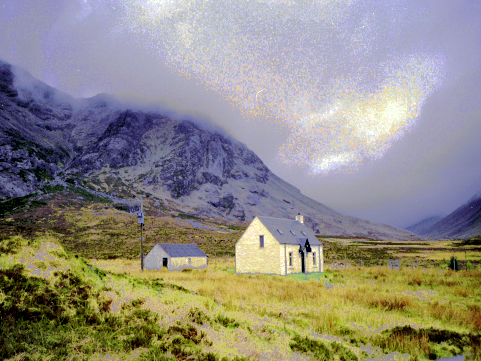
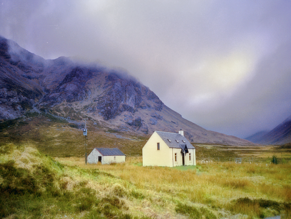

# colour transfer

This package contains two scripts to run colour grading as described in

```
[Pitie05a] N-Dimensional Probability Density Function Transfer and its
Application to Colour Transfer. F. Pitie , A. Kokaram and R. Dahyot
(2005) In International Conference on Computer Vision (ICCV'05). Beijing,
October.

[Pitie05b] Towards Automated Colour Grading. F. Pitié , A. Kokaram and
R. Dahyot (2005) In 2nd IEE European Conference on Visual Media
Production (CVMP'05). London, November.

[Pitie07a] Automated colour grading using colour distribution transfer.
F. Pitie , A. Kokaram and R. Dahyot (2007) Computer Vision and Image
Understanding.

[Pitie07b] The linear Monge-Kantorovitch linear colour mapping for
example-based colour transfer. F. Pitié and A. Kokaram (2007) In 4th
IEE European Conference on Visual Media Production (CVMP'07). London,
November.

[Pitie08] Enhancement of Digital Photographs Using Color Transfer Techniques.
F. Pitié, A. Kokaram and R. Dahyot (2008). Single-Sensor Imaging. Sep 2008,
295 -321
```

Pictures on this webpage are released free of copyrights. Please cite our publications when using our code and pictures ([bib](colour_transfer.bib)).

Send an email to fpitie@mee.tcd.ie if you want more information

## Example

```Matlab
I0 = double(imread('scotland_house.png'))/255;	 % reference image
I1 = double(imread('scotland_plain.png'))/255;   % target palette
IR_idt = colour_transfer_IDT(I0, I1, 10);        % [Pitie07a,Pitie05a,Pitie05b]
IR_mkl = colour_transfer_MKL(I0, I1);     	   	 % [Pitie07b] in RGB space
IR_regrain = regrain(I0, IR_idt);     	   	     % [Pitie07a,Pitie05b]
```

Note that the IDT method uses random colour directions, hence results will differ from the results published here in `result_IDT.png`.

<table style="width:100%">
<tr>
<td></td>
<td></td>
</tr>
<tr>
<td>input ref</td>
<td>input target</td>
</tr>
<tr>
<td></td>
<td></td>
</tr>
<tr>
<td>IDT Solution (10 iterations)</td>
<td>IDT followed by regrain</td>
</tr>
<tr>
<td></td>
<td></td>
</tr>
<tr>
<td>Linear Monge-Kantorovitch solution in RGB space</td>
<td></td>
</tr>
</table>

